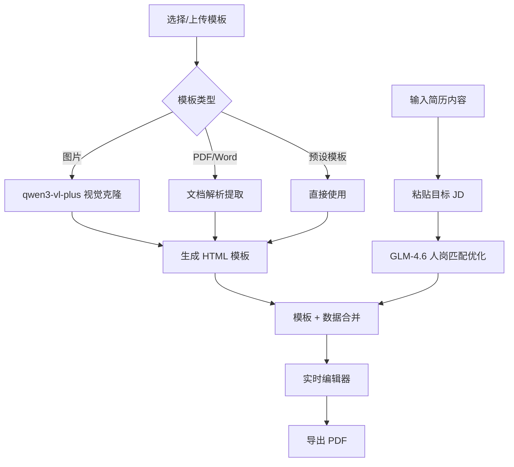

# ResumeCloner AI 🎨

> 高端简历 · 视觉复刻 + 智能岗匹 | Strategic Resume Tailoring & Cloning

[](https://react.dev/)
[](https://www.typescriptlang.org/)
[](https://vitejs.dev/)
[](LICENSE)

---

## ✨ 项目简介

**ResumeCloner AI** 是一款基于人工智能的简历克隆与优化工具。它能够：

- 🎯 **视觉复刻**：上传任意简历模板图片，AI 自动识别布局结构并生成可编辑的 HTML 模板
- 🧠 **智能岗匹**：根据目标岗位 JD（Job Description），智能优化简历内容，突出匹配亮点
- ✏️ **实时编辑**：可视化编辑器，所见即所得，支持一键导出 PDF
- 🌐 **双语支持**：完整的中英文界面切换

---

## 🛠️ 技术栈

| 层级 | 技术 | 用途 |
|------|------|------|
| **前端框架** | React 19 + TypeScript | 核心 UI 框架 |
| **构建工具** | Vite 6 | 快速开发与构建 |
| **样式方案** | Tailwind CSS | 原子化 CSS 样式 |
| **图标库** | Lucide React | 精美 SVG 图标 |
| **AI 视觉** | qwen3-vl-plus (iFlow) | 图片识别与模板克隆 |
| **AI 文本** | GLM-4.6 (iFlow) | 简历内容优化与人岗匹配 |
| **后端服务** | Express.js | Word 文档解析服务 |
| **文档解析** | word-extractor, iconv-lite | DOC/DOCX 文本提取 |

---

## 🚀 快速开始

### 1. 克隆项目

```bash
git clone https://github.com/your-username/resumecloner-ai.git
cd resumecloner-ai
```

### 2. 安装依赖

```bash
npm install
```

### 3. 配置环境变量

创建 `.env.local` 文件：

```bash
# iFlow API 密钥（用于 qwen3-vl-plus 和 GLM-4.6）
GLM_API_KEY=your_iflow_api_key_here

# Gemini API 密钥（可选，备用）
GEMINI_API_KEY=your_gemini_api_key_here
```

> 💡 **获取 API Key**：访问 [iFlow 平台](https://apis.iflow.cn) 注册并获取 API 密钥

### 4. 启动开发服务器

```bash
# 启动前端（默认端口 5173）
npm run dev

# 启动后端服务（用于 Word 文档解析，端口 3002）
npm run server
```

### 5. 访问应用

打开浏览器访问 `http://localhost:5173`

---

## 📁 项目结构

```
resumecloner-ai/
├── App.tsx                 # 主应用组件，状态管理与流程控制
├── index.tsx               # React 入口文件
├── index.html              # HTML 模板（含 Tailwind CDN）
├── types.ts                # TypeScript 类型定义
├── vite.config.ts          # Vite 构建配置
├── server.cjs              # Express 后端服务（Word 解析）
│
├── components/             # React 组件
│   ├── EditorLayout.tsx    # 简历编辑器主布局
│   ├── StepUpload.tsx      # 步骤1：模板上传组件
│   ├── StepContent.tsx     # 步骤2：内容输入组件
│   ├── StepProcessing.tsx  # 步骤3：AI 处理进度展示
│   └── TemplateGallery.tsx # 预设模板选择画廊
│
├── services/               # 服务层
│   ├── geminiService.ts    # AI 服务（视觉克隆 + 内容优化）
│   ├── pdfParser.ts        # PDF 解析服务
│   └── templateExtractor.ts# 模板提取逻辑
│
├── contexts/               # React 上下文
│   └── LanguageContext.tsx # 多语言支持
│
├── templates/              # 预设模板资源
└── utils/                  # 工具函数
```

---

## 🔄 工作流程



### 核心步骤说明

1. **步骤一：选择模板**
   - 从预设模板库选择
   - 上传简历图片（JPG/PNG）进行视觉克隆
   - 上传 PDF/Word 文档提取模板和内容

2. **步骤二：输入内容**
   - 粘贴或上传原始简历内容
   - 输入目标岗位 JD（职位描述）

3. **步骤三：AI 处理**
   - **视觉架构师**：分析模板布局，生成 HTML/CSS 代码
   - **策略顾问**：根据 JD 优化简历内容，突出匹配点

4. **步骤四：编辑导出**
   - 可视化编辑简历各字段
   - 实时预览效果
   - 一键导出高质量 PDF

---

## 🎨 核心功能

### 视觉模板克隆

使用 `qwen3-vl-plus` 多模态模型，能够：

- 识别简历的布局结构（单栏/双栏/混合）
- 提取精确的颜色、字体、间距
- 生成带占位符的可复用 HTML 模板
- 自动分析适合的字数限制

```typescript
// 视觉克隆核心调用
const result = await generateTemplateFromImage(base64Image);
// 返回: { htmlTemplate, layoutLimits, pageSize }
```

### 智能人岗匹配

使用 `GLM-4.6` 模型，能够：

- 分析 JD 中的核心技能要求
- 筛选并突出相关工作经历
- 使用 STAR 法则优化描述
- 植入关键词提高 ATS 通过率

```typescript
// 内容优化核心调用
const data = await extractDataFromText(resumeText, jdText);
// 返回: ResumeData 结构化数据
```

### 动态布局限制

系统会根据模板自动计算各字段的最大字符数：

| 字段 | 默认限制 | 说明 |
|------|---------|------|
| 姓名 | 15 字符 | `fullName` |
| 职位 | 25 字符 | `title` |
| 简介 | 200 字符 | `summary` |
| 工作描述 | 60 字符/条 | `expDescription` |
| 技能标签 | 12 字符/个 | `skillName` |

---

## 📜 可用脚本

```bash
# 开发模式
npm run dev

# 构建生产版本
npm run build

# 预览生产构建
npm run preview

# 启动后端服务器
npm run server
```

---

## 🌍 多语言支持

应用支持中英文切换，通过 `LanguageContext` 实现：

```tsx
import { useLanguage } from './contexts/LanguageContext';

const MyComponent = () => {
  const { t, language, setLanguage } = useLanguage();
  
  return (
    <button onClick={() => setLanguage(language === 'en' ? 'zh' : 'en')}>
      {t.switchLanguage}
    </button>
  );
};
```

---

## 📝 类型定义

核心数据类型位于 `types.ts`：

```typescript
// 简历数据结构
interface ResumeData {
  fullName: string;
  title: string;
  photoUrl?: string;
  contact: { email, phone, location, linkedin?, website? };
  summary: string;
  experience: Array<{ company, role, duration, description[] }>;
  skills: string[];
  education: Array<{ school, degree, year }>;
}

// 布局限制
interface LayoutLimits {
  fullName: number;
  title: number;
  summary: number;
  expDescription: number;
  // ...
}

// 页面尺寸
interface PageSize {
  width: number;   // mm
  height: number;  // mm
  aspectRatio: number;
}
```

---

## 🔧 后端服务

`server.cjs` 提供 Word 文档解析能力：

| 端点 | 方法 | 描述 |
|------|------|------|
| `/api/extract-text` | POST | 从 .doc 文件提取纯文本 |
| `/api/extract-docx-template` | POST | 从 Word 文档提取模板 |

支持的格式：
- RTF 格式
- Word 2003 XML
- 二进制 DOC (OLE 复合文档)
- 多种中文编码（GBK、GB18030）

---

## 🤝 贡献指南

欢迎贡献代码！请遵循以下步骤：

1. Fork 项目
2. 创建功能分支 (`git checkout -b feature/AmazingFeature`)
3. 提交更改 (`git commit -m 'Add some AmazingFeature'`)
4. 推送到分支 (`git push origin feature/AmazingFeature`)
5. 创建 Pull Request

---

## 📄 许可证

本项目采用 MIT 许可证 - 详见 [LICENSE](LICENSE) 文件

---

## 🙏 致谢

- [iFlow](https://apis.iflow.cn) - 提供 qwen3-vl-plus 和 GLM-4.6 API
- [Tailwind CSS](https://tailwindcss.com) - 原子化 CSS 框架
- [Lucide](https://lucide.dev) - 精美图标库
- [Vite](https://vitejs.dev) - 下一代前端构建工具

---

<p align="center">
  Made with ❤️ by ResumeCloner Team
</p>
